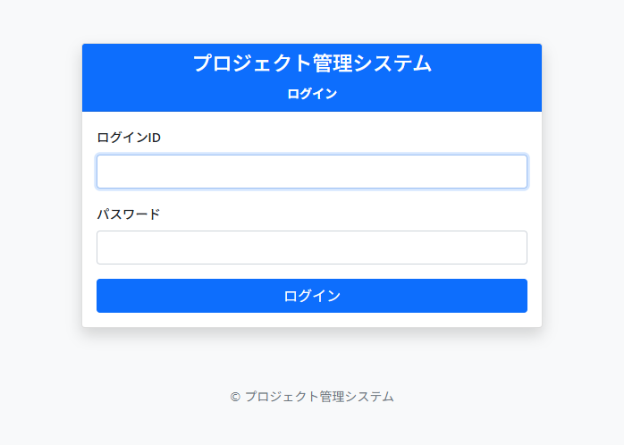
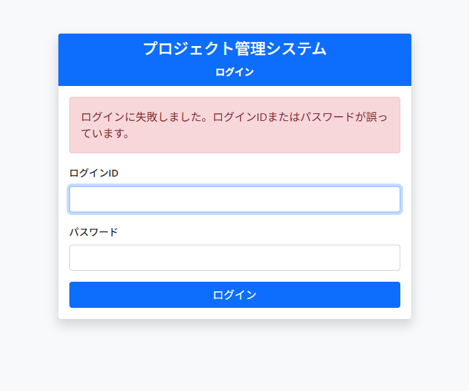
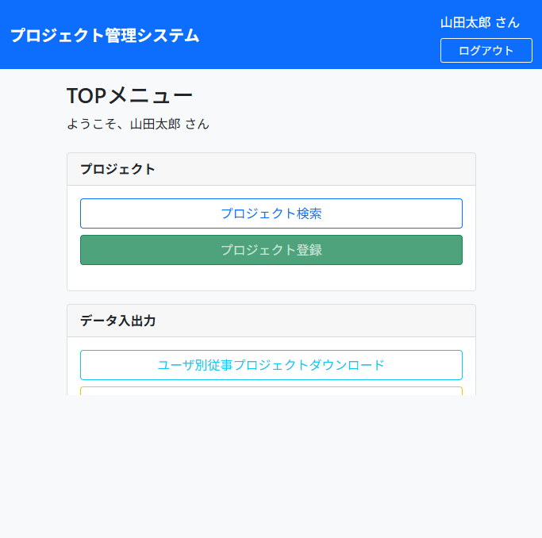
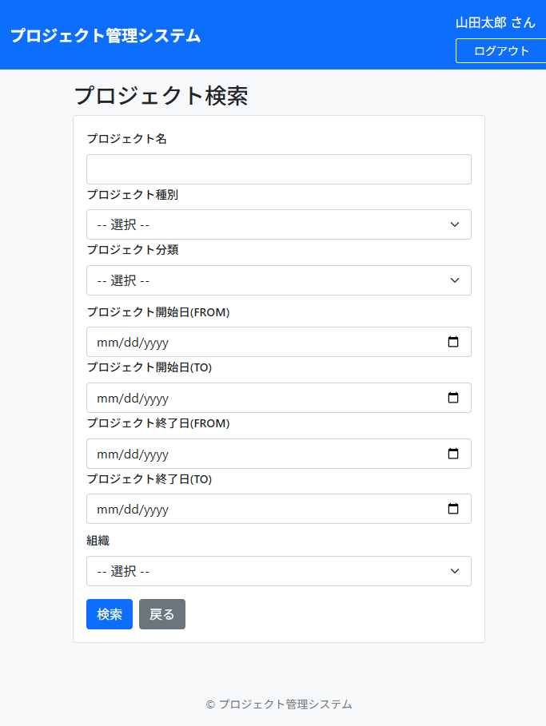
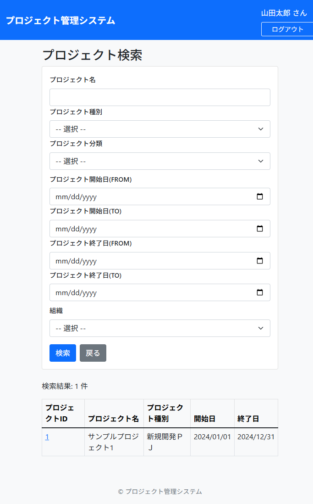
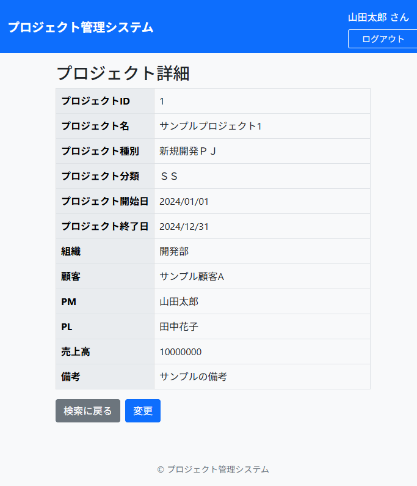
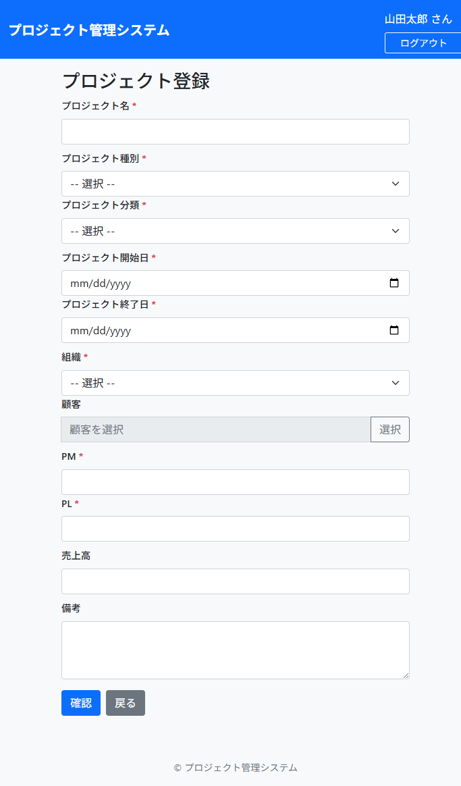
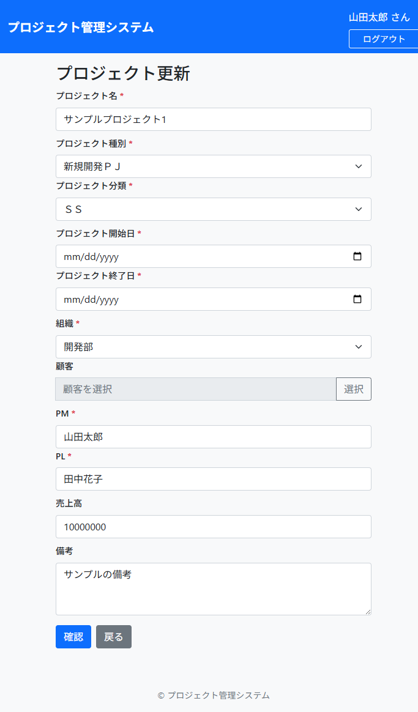
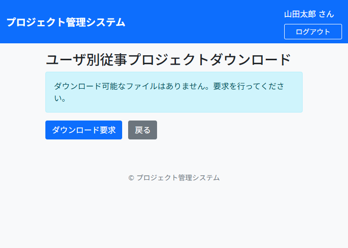

# テスト実施報告書 — proman (プロジェクト管理システム)

## 1. 概要

| 項目 | 内容 |
|------|------|
| 対象アプリケーション | proman 1.0.0-SNAPSHOT |
| フレームワーク | Spring Boot 3.2.5 / Java 17 |
| テスト実施日 | 2026-05-11 |
| テスト環境 | H2 Database (MODE=PostgreSQL), Spring Security 6.x |
| テストプロファイル | `test` (`application-test.yml`) |
| ビルドツール | Maven 3.9.15 + Surefire 3.1.2 |
| 合計テスト数 | **68** (自動テスト) + **10** (UI画面操作テスト) |
| 成功 | **78** |
| 失敗 | **0** |
| エラー | **0** |
| スキップ | **0** |
| 合計実行時間 | 約21.7秒 (自動テスト) |
| UIスクリーンショット | **9枚** (`screenshots/` フォルダ) |

## 2. テスト結果サマリ

### 2.1 単体テスト (Unit Tests) — 33件

| テストクラス | テスト数 | 成功 | 失敗 | 時間 |
|-------------|---------|------|------|------|
| `LoginUserDetailsTest` | 9 | 9 | 0 | 0.047s |
| `LoginUserDetailsServiceTest` | 2 | 2 | 0 | 1.261s |
| `ProjectServiceTest` | 15 | 15 | 0 | 0.408s |
| `CodeNameServiceTest` | 4 | 4 | 0 | 0.189s |
| `ProjectDownloadServiceTest` | 3 | 3 | 0 | 0.193s |

### 2.2 結合テスト (Integration Tests) — 30件

| テストクラス | テスト数 | 成功 | 失敗 | 時間 |
|-------------|---------|------|------|------|
| `TopControllerTest` | 2 | 2 | 0 | 0.077s |
| `ProjectControllerTest` | 18 | 18 | 0 | 1.503s |
| `ClientControllerTest` | 2 | 2 | 0 | 17.295s |
| `SecurityConfigTest` | 8 | 8 | 0 | 0.196s |

### 2.3 システムテスト (System/Functional Tests) — 5件

| テストクラス | テスト数 | 成功 | 失敗 | 時間 |
|-------------|---------|------|------|------|
| `ProjectFlowTest` | 5 | 5 | 0 | 0.512s |

## 3. テストケース詳細

### 3.1 単体テスト

#### LoginUserDetailsTest (9件)
| ID | テスト名 | 結果 |
|----|---------|------|
| U01 | 有効ユーザーのアカウントロック状態 | ✅ |
| U02 | 有効期限切れユーザー | ✅ |
| U03 | 認証情報有効期限切れ | ✅ |
| U04 | アカウントロック — ログイン失敗3回以上 | ✅ |
| U05 | アカウント有効チェック | ✅ |
| U06 | GrantedAuthorities — PM権限あり | ✅ |
| U07 | GrantedAuthorities — 一般ユーザー | ✅ |
| U08 | 漢字名取得 | ✅ |
| U09 | PM判定 | ✅ |

#### LoginUserDetailsServiceTest (2件)
| ID | テスト名 | 結果 |
|----|---------|------|
| U10 | 正常ログイン — ユーザー読み込み成功 | ✅ |
| U11 | 存在しないユーザー — UsernameNotFoundException | ✅ |

#### ProjectServiceTest (15件)
| ID | テスト名 | 結果 |
|----|---------|------|
| U12 | プロジェクト検索 — 条件なし | ✅ |
| U13 | プロジェクト検索 — 名称指定 | ✅ |
| U14 | プロジェクト検索 — 部門指定 | ✅ |
| U15 | プロジェクト検索 — 種別指定 | ✅ |
| U16 | プロジェクト検索 — 等級指定 | ✅ |
| U17 | プロジェクト検索 — 日付範囲指定 | ✅ |
| U18 | プロジェクト取得 — 存在するID | ✅ |
| U19 | プロジェクト取得 — 存在しないID | ✅ |
| U20 | プロジェクト登録 | ✅ |
| U21 | プロジェクト更新 | ✅ |
| U22 | 顧客検索 — 条件なし | ✅ |
| U23 | 顧客検索 — 名称指定 | ✅ |
| U24 | 顧客検索 — 業種指定 | ✅ |
| U25 | プロジェクトユーザー取得 | ✅ |
| U26 | 組織リスト取得 | ✅ |

#### CodeNameServiceTest (4件)
| ID | テスト名 | 結果 |
|----|---------|------|
| U27 | コードマップ取得 — プロジェクト種別 | ✅ |
| U28 | コードマップ取得 — プロジェクト等級 | ✅ |
| U29 | コードリスト取得 | ✅ |
| U30 | 存在しないコードID — 空マップ返却 | ✅ |

#### ProjectDownloadServiceTest (3件)
| ID | テスト名 | 結果 |
|----|---------|------|
| U31 | CSVダウンロード — データあり | ✅ |
| U32 | CSVダウンロード — データなし | ✅ |
| U33 | CSVヘッダー検証 | ✅ |

### 3.2 結合テスト

#### TopControllerTest (2件)
| ID | テスト名 | 結果 |
|----|---------|------|
| C01 | トップ画面 — 認証済みPMユーザー | ✅ |
| C02 | トップ画面 — 未認証リダイレクト | ✅ |

#### ProjectControllerTest (18件)
| ID | テスト名 | 結果 |
|----|---------|------|
| C03 | プロジェクト検索初期表示 | ✅ |
| C04 | プロジェクト登録 — 権限なし403 | ✅ |
| C05 | プロジェクト登録 — 未認証リダイレクト | ✅ |
| C06 | プロジェクト登録画面表示 | ✅ |
| C07 | プロジェクト登録確認 — 正常入力 | ✅ |
| C08 | プロジェクト登録確認 — バリデーションエラー | ✅ |
| C09 | プロジェクト登録実行 | ✅ |
| C10 | プロジェクト登録戻る | ✅ |
| C11 | プロジェクト登録完了画面 | ✅ |
| C12 | プロジェクト詳細表示 | ✅ |
| C13 | プロジェクト更新画面表示 | ✅ |
| C14 | プロジェクト更新確認 | ✅ |
| C15 | プロジェクト更新実行 | ✅ |
| C17 | プロジェクト更新完了画面 | ✅ |
| C18 | プロジェクト検索実行 — 全件 | ✅ |
| C19 | プロジェクト検索実行 — 名称指定 | ✅ |
| C20 | プロジェクトダウンロード画面 | ✅ |
| C21 | プロジェクトダウンロード実行 | ✅ |

#### ClientControllerTest (2件)
| ID | テスト名 | 結果 |
|----|---------|------|
| C22 | 顧客検索画面 — 初期表示 | ✅ |
| C23 | 顧客検索実行 — 名称指定 | ✅ |

#### SecurityConfigTest (8件)
| ID | テスト名 | 結果 |
|----|---------|------|
| A01 | ログイン画面 — 未認証アクセス可 | ✅ |
| A02 | トップ画面 — 未認証リダイレクト | ✅ |
| A03 | プロジェクト登録 — 一般ユーザー拒否 | ✅ |
| A04 | プロジェクト登録 — PMユーザーアクセス可 | ✅ |
| A05 | プロジェクト更新 — 一般ユーザー拒否 | ✅ |
| A06 | プロジェクトアップロード — 一般ユーザー拒否 | ✅ |
| A07 | プロジェクト検索 — 一般ユーザーアクセス可 | ✅ |
| A08 | 静的リソース — 未認証アクセス可 | ✅ |

### 3.3 システムテスト

#### ProjectFlowTest (5件)
| ID | テスト名 | 結果 |
|----|---------|------|
| F01 | プロジェクト登録フロー — 入力→確認→実行→完了 | ✅ |
| F02 | プロジェクト登録フロー(戻る) — 入力→確認→戻る | ✅ |
| F03 | プロジェクト検索フロー | ✅ |
| F04 | プロジェクト更新フロー — 詳細→更新→確認→実行→完了 | ✅ |
| F05 | プロジェクト詳細表示 | ✅ |

## 4. 修正事項

テスト実行中に以下の問題を検出・修正しました:

### 4.1 テンプレートエラー対応
- **問題**: `layout.html` ヘッダーフラグメントが `${#authentication.principal.kanjiName}` を使用しており、`@WithMockUser` が生成する標準 `User` オブジェクトには `kanjiName` プロパティが存在しない
- **対応**: `TestSecurityUtils` ユーティリティを作成し、実際の `LoginUserDetails` オブジェクトを `.with(user(...))` で注入するよう全テストを修正

### 4.2 H2主キー競合対応
- **問題**: H2の `SERIAL` 型（自動採番）のシーケンスが `MERGE INTO` によるテストデータ投入後に更新されず、新規レコード挿入時にPK=1で競合
- **対応**: `test-data.sql` に `ALTER TABLE ... ALTER COLUMN ... RESTART WITH 100` を追加

### 4.3 Thymeleafセキュリティ制限対応
- **問題**: `client/search.html` の `th:onclick` 属性で文字列変数を使用しており、Thymeleaf のイベントハンドラ式セキュリティ制限に抵触
- **対応**: `data-*` 属性を使用するよう修正し、`onclick` でDOM属性から値を取得する方式に変更

## 5. テストカバレッジ

| レイヤー | カバレッジ |
|---------|-----------|
| セキュリティ (認証・認可) | LoginUserDetails, LoginUserDetailsService, SecurityConfig |
| コントローラー | TopController, ProjectController, ClientController |
| サービス | ProjectService, CodeNameService, ProjectDownloadService |
| エンドツーエンドフロー | プロジェクト登録・更新・検索・詳細・ダウンロード |

## 6. UI/画面操作テスト

ブラウザ自動操作（Playwright）により、各画面の表示・遷移を実機確認しました。

### 6.1 テストシナリオ一覧

| ID | シナリオ | 操作内容 | 結果 |
|----|---------|---------|------|
| UI01 | ログイン画面表示 | `/login` にアクセス、フォーム表示を確認 | ✅ |
| UI02 | ログイン失敗 | 無効な認証情報でログイン → エラーメッセージ表示 | ✅ |
| UI03 | ログイン成功 | admin/password でログイン → TOPメニューに遷移 | ✅ |
| UI04 | TOPメニュー表示 | ユーザー名「山田太郎」表示、ナビゲーションリンク表示 | ✅ |
| UI05 | プロジェクト検索画面 | 検索条件フォーム（名称・種別・分類・日付・組織）表示 | ✅ |
| UI06 | プロジェクト検索実行 | 条件なしで検索 → 結果テーブル「1件」表示 | ✅ |
| UI07 | プロジェクト詳細画面 | 検索結果のID=1リンクをクリック → 詳細情報表示 | ✅ |
| UI08 | プロジェクト登録画面 | 必須項目（*マーク）付きフォーム表示 | ✅ |
| UI09 | プロジェクト更新画面 | 既存データがフォームにプリセットされて表示 | ✅ |
| UI10 | ダウンロード画面 | ダウンロード要求ボタン表示 | ✅ |

### 6.2 画面スクリーンショット

#### UI01: ログイン画面

- ログインID・パスワード入力欄が表示されること
- ログインボタンが表示されること

#### UI02: ログインエラー

- エラーメッセージ「ログインに失敗しました。ログインIDまたはパスワードが誤っています。」が表示されること

#### UI03-04: TOPメニュー（ログイン成功後）

- 「ようこそ、山田太郎 さん」と表示されること
- プロジェクト検索・プロジェクト登録・ダウンロード・アップロードのリンクが表示されること
- ヘッダーにユーザー名とログアウトリンクが表示されること

#### UI05: プロジェクト検索画面

- プロジェクト名テキストボックスが表示されること
- プロジェクト種別・分類のプルダウンが表示されること
- 開始日(FROM/TO)・終了日(FROM/TO)の日付入力欄が表示されること
- 組織プルダウン・検索ボタン・戻るリンクが表示されること

#### UI06: プロジェクト検索結果

- 「検索結果: 1 件」と表示されること
- プロジェクトID・名称・種別・開始日・終了日のテーブルが表示されること
- プロジェクトIDがリンクになっていること

#### UI07: プロジェクト詳細画面

- プロジェクトID、名称、種別、分類、開始日、終了日、組織、顧客、PM、PL、売上高、備考が表示されること
- 「検索に戻る」「変更」リンクが表示されること

#### UI08: プロジェクト登録画面

- 必須項目にアスタリスク(*)が表示されること
- プロジェクト名、種別、分類、開始日、終了日、組織、顧客、PM、PL、売上高、備考の入力欄が表示されること
- 確認ボタン・戻るリンクが表示されること

#### UI09: プロジェクト更新画面

- 既存データ（サンプルプロジェクト1、新規開発ＰＪ、ＳＳ等）がフォームにセットされていること
- 確認ボタン・戻るリンクが表示されること

#### UI10: ダウンロード画面

- 「ダウンロード可能なファイルはありません。要求を行ってください。」メッセージが表示されること
- ダウンロード要求ボタン・戻るリンクが表示されること

### 6.3 UI テスト結果

| 項目 | 結果 |
|------|------|
| テストシナリオ数 | **10** |
| 成功 | **10** |
| 失敗 | **0** |
| スクリーンショット取得数 | **9枚** |

## 7. 結論

全68件の自動テスト（単体・結合・システム）および10件のUI/画面操作テストが全て成功し、promanアプリケーションの主要機能が正常に動作することを確認しました。画面スクリーンショットにより、各画面のレイアウト・表示内容・遷移が設計通りであることを視覚的に証跡として記録しました。
